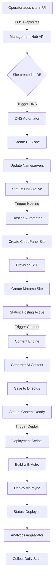

# Website Factory - Project Navigation & Flow Guide

This guide helps developers understand the project structure, how components interact, and the flow of data through the system.

## 🗺️ Project Structure Overview

```
WebsiteFactory/
├── docs/                        # System-wide documentation
│   ├── SYSTEM_PRD.md           # Overall product requirements
│   ├── SYSTEM_TDD.md           # Technical architecture
│   ├── PROJECT_STATUS.md       # Current development status
│   └── PROJECT_NAVIGATION.md   # This file
│
├── management-hub-api/         # Central orchestrator (FastAPI)
├── management-hub-ui/          # Dashboard interface (React)
├── dns-automator/             # DNS configuration service
├── hosting-automator/         # Server provisioning service
├── content-engine/            # AI content generation
├── deployment-scripts/        # Static site deployment
├── analytics-aggregator/      # Data collection service
│
└── setup-scripts/             # Infrastructure setup helpers
```

## 🏗️ Architecture Overview

### Deployment Architecture

```
┌─────────────── Railway Cloud ───────────────┐     ┌────── Vultr Server ──────┐
│                                             │     │                          │
│  Management Hub API  ←→  Management Hub UI  │     │  CloudPanel (Port 8080)  │
│         ↓                                   │     │  Directus   (Port 8055)  │
│  DNS Automator                              │     │  Matomo     (Port 8056)  │
│  Hosting Automator   ←──────────────────────┼─SSH→│  200+ Static Websites    │
│  Content Engine                             │     │                          │
│  Deployment Scripts  ←──────────────────────┼─SSH→│                          │
│  Analytics Aggregator                       │     │                          │
└─────────────────────────────────────────────┘     └──────────────────────────┘
                    ↓
            Supabase Database
          (Central State Store)
```

## 📁 Module Deep Dive

### 1. Management Hub API (`/management-hub-api`)
**Purpose**: Central orchestrator for all automation workflows

**Key Files**:
- `app/main.py` - FastAPI application entry point
- `app/api/` - REST endpoints
- `app/services/workflow_service.py` - Orchestrates automation modules
- `app/models/` - Database models
- `app/schemas/` - Pydantic validation schemas

**Responsibilities**:
- Authentication (JWT)
- Site management CRUD
- Workflow orchestration
- Credential management
- Status tracking

### 2. Management Hub UI (`/management-hub-ui`)
**Purpose**: Web dashboard for system operators

**Key Files**:
- `src/App.tsx` - Main React component
- `src/pages/` - Page components (Dashboard, Sites, Settings)
- `src/components/` - Reusable UI components
- `src/lib/api.ts` - API client
- `src/hooks/` - Custom React hooks

**Tech Stack**:
- React + TypeScript
- Vite build tool
- shadcn/ui components
- TanStack Query for data fetching

### 3. DNS Automator (`/dns-automator`)
**Purpose**: Automates DNS configuration across Namecheap/Cloudflare

**Key Files**:
- `app.py` - FastAPI service
- `dns_automator/main.py` - Core orchestrator
- `dns_automator/services/` - External API integrations
  - `namecheap_api.py` - Nameserver updates
  - `cloudflare_api.py` - Zone/record management

**Workflow**:
1. Receives site ID from Management Hub
2. Creates Cloudflare zone
3. Gets assigned nameservers
4. Updates nameservers at registrar
5. Creates DNS records

### 4. Hosting Automator (`/hosting-automator`)
**Purpose**: Provisions hosting environments on CloudPanel

**Key Files**:
- `app.py` - FastAPI service
- `hosting_automator/main.py` - Core orchestrator
- `hosting_automator/services/` - Service integrations
  - `cloudpanel_client.py` - SSH/CLI automation
  - `matomo_client.py` - Analytics setup

**Workflow**:
1. Connects via SSH to server
2. Creates static site via `clpctl`
3. Provisions SSL certificate
4. Creates Matomo tracking site
5. Updates database with paths

### 5. Content Engine (`/content-engine`)
**Purpose**: Generates AI-powered content

**Planned Structure**:
- Data collection from web sources
- AI prompt engineering
- Content generation (OpenAI/Gemini)
- Directus CMS integration

### 6. Deployment Scripts (`/deployment-scripts`)
**Purpose**: Builds and deploys static sites

**Planned Workflow**:
1. Pulls content from Directus
2. Runs Astro build process
3. Deploys via rsync over SSH
4. Verifies with Google

### 7. Analytics Aggregator (`/analytics-aggregator`)
**Purpose**: Collects performance data

**Planned Features**:
- Matomo API integration
- Google Search Console data
- Daily aggregation to Supabase

## 🔄 Complete Site Creation Flow



## 🔑 Key Integration Points

### 1. Database (Supabase)
All modules read/write to central Supabase database:
- `sites` table - Central site registry
- `cloudflare_accounts` - CF credentials
- `servers` - SSH connection info
- `infrastructure_services` - Matomo, etc.
- `daily_analytics` - Performance data

### 2. Inter-Service Communication
- Management Hub → Automation Modules: HTTP POST to `/process`
- All services use Railway's private networking
- Example: `http://dns-automator.railway.internal/process`

### 3. External APIs
- **Namecheap**: Domain nameserver management
- **Cloudflare**: DNS zone/record management
- **Matomo**: Analytics tracking
- **OpenAI/Gemini**: Content generation
- **Google**: Search Console & Verification

## 🛠️ Development Workflow

### Adding a New Site (Developer Perspective)

1. **UI Action**: User clicks "Add Site" in React UI
2. **API Request**: `POST /api/sites` with domain & CF account
3. **Database**: New record created with `pending` statuses
4. **Background Task**: API calls DNS Automator
5. **DNS Setup**: Automator configures DNS, updates status
6. **Cascade**: Status change triggers Hosting Automator
7. **Repeat**: Each module triggers the next

### Module Development Pattern

Each automation module follows the same pattern:

```python
# 1. FastAPI service (app.py)
@app.post("/process")
async def process(request: ProcessRequest):
    # Receive credentials from Management Hub
    # Run automation in background
    
# 2. Main orchestrator (main.py)
class ModuleAutomator:
    def run(self):
        # Fetch work from database
        # Process each item
        # Update status
        
# 3. Service clients (services/)
# External API integrations
# Database operations
```

## 🧪 Testing Strategy

### Local Development
1. **Supabase**: Use local instance or dev project
2. **Mock Mode**: Services can run with mock external APIs
3. **Docker Compose**: Spin up local Directus/Matomo

### Integration Testing
1. Use test domains
2. Separate Cloudflare test accounts
3. Staging Railway environment

## 🚀 Deployment Process

### For Automation Modules (Railway)
```bash
git push origin main
# Railway auto-deploys from GitHub
```

### For Management Hub Updates
```bash
# API
cd management-hub-api
git push origin main

# UI
cd management-hub-ui
git push origin main
```

### For Infrastructure Changes
- SSH to Vultr server
- Update Docker containers
- Restart services as needed

## 📝 Common Tasks

### Check Module Status
```bash
# View Railway logs
railway logs -s dns-automator

# Check service health
curl https://dns-automator.up.railway.app/health
```

### Debug Failed Workflow
1. Check `sites` table for error_message
2. View module logs in Railway
3. Check external API responses
4. Verify credentials in Supabase

### Add New Cloudflare Account
1. Create account on Cloudflare
2. Generate API token
3. Add to `cloudflare_accounts` table
4. Available immediately in UI dropdown

## 🔐 Security Considerations

1. **Credentials**: Never in code, always from database
2. **SSH Keys**: Stored encrypted in Supabase
3. **API Tokens**: Scoped to minimum permissions
4. **Network**: Railway private networking for inter-service
5. **Validation**: Input sanitization in all modules

## 📚 Further Reading

- Module-specific docs: Check each module's README.md
- System architecture: See SYSTEM_TDD.md
- Current status: See PROJECT_STATUS.md
- Infrastructure setup: See INFRASTRUCTURE_SETUP.md

---

This guide should help any developer quickly understand how the Website Factory system works and where to find specific functionality.