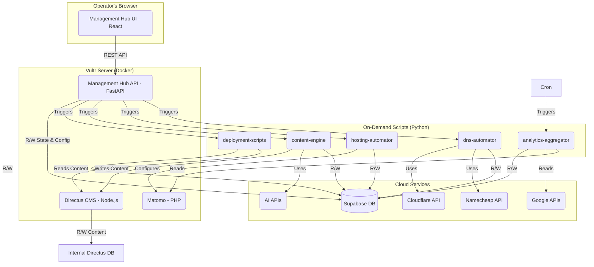

# Technical Design Document: Website Factory System

## 1. System architecture

The Website Factory is a distributed system composed of several independent modules orchestrated by a central API and database. The architecture is designed for modularity, scalability, and maintainability.

*   **Hosting Environment**: A primary Vultr cloud server will host the long-running services.
*   **Containerization**: Docker and Docker Compose will be used to run all long-running services in isolated containers on the Vultr server. This includes the Management Hub API, Management Hub UI (in standalone mode), Directus, and Matomo.
*   **Central Database & Config Store**: A Supabase project will serve as the primary PostgreSQL database. It will store all configuration data (API keys, tokens), the state of each managed site (`sites` table), and the aggregated analytics data. It is the single source of truth for the system's state.
*   **Headless CMS**: A single, self-hosted Directus instance will manage content for all 200+ websites in a multi-tenant fashion, with content relationally linked to a `sites` collection.
*   **Automation Scripts**: A set of independent Python scripts (`dns-automator`, `hosting-automator`, etc.) will reside in their respective folders on the server's filesystem. They are stateless and executed on-demand.
*   **Orchestration**: The **Management Hub API** (FastAPI) acts as the central orchestrator. It receives requests from the UI and triggers the appropriate Python automation scripts as asynchronous background tasks (using FastAPI BackgroundTasks or Celery).
*   **Frontend**: The **Management Hub UI** (React) is a single-page application that communicates exclusively with the Management Hub API.
*   **Static Site Generator**: **Astro** is used as the build tool. The deployment script will execute the Astro build command to generate static files.
*   **Deployment Mechanism**: The `deployment-scripts` module will use **`rsync` over SSH** to transfer the built static files from a temporary build location to the final document root on the CloudPanel server.

### 1.1. System data flow diagram

## 2. Database schema design (Supabase)

The central Supabase instance will host the following key tables.

### 2.1. `cloudflare_accounts`

Stores credentials for the ~25 manually created Cloudflare accounts.

| Column Name | Data Type | Constraints | Description |
| :--- | :--- | :--- | :--- |
| `id` | `uuid` | Primary Key, default `gen_random_uuid()` | Unique identifier for the account record. |
| `created_at` | `timestamptz` | Not Null, default `now()` | Timestamp of creation. |
| `email` | `text` | Not Null, Unique | Email address used for the Cloudflare account. |
| `account_nickname` | `text` | Not Null, Unique | User-friendly name for UI selectors (e.g., "CF_Batch_1"). |
| `api_token` | `text` | Not Null | The securely stored, scoped Cloudflare API Token. |

### 2.2. `gsc_accounts`

Stores credentials for the ~5 Google accounts used for Search Console access.

| Column Name | Data Type | Constraints | Description |
| :--- | :--- | :--- | :--- |
| `id` | `uuid` | Primary Key | Unique identifier for the account record. |
| `email` | `text` | Not Null, Unique | Email address for the Google account. |
| `oauth_refresh_token`| `text` | Not Null | The securely stored OAuth 2.0 refresh token. |

### 2.3. `sites`

The central table tracking the state and metadata of every managed website.

| Column Name | Data Type | Constraints | Description |
| :--- | :--- | :--- | :--- |
| `id` | `uuid` | Primary Key | Unique identifier for the website record. |
| `created_at` | `timestamptz` | Not Null, default `now()` | Timestamp of creation. |
| `domain` | `text` | Not Null, Unique | The website's domain name (e.g., "example.com"). |
| `brand_name` | `text` | Nullable | The brand name associated with the site. |
| `cloudflare_account_id` | `uuid` | Not Null, Foreign Key to `cloudflare_accounts.id` | Which Cloudflare account manages this site. |
| `gsc_account_id` | `uuid` | Nullable, Foreign Key to `gsc_accounts.id` | Which GSC account manages this site. |
| `status_dns` | `text` | Not Null, default `'pending'` | Workflow status: 'pending', 'active', 'failed'. |
| `status_hosting` | `text` | Not Null, default `'pending'` | Workflow status: 'pending', 'active', 'failed'. |
| `status_content` | `text` | Not Null, default `'pending'` | Workflow status: 'pending', 'generating', 'generated', 'failed'. |
| `status_deployment` | `text` | Not Null, default `'pending'` | Workflow status: 'pending', 'deploying', 'deployed', 'failed'. |
| `hosting_doc_root` | `text` | Nullable | The absolute path to the site's root on the server. |
| `matomo_site_id` | `integer` | Nullable | The site ID from the Matomo instance. |
| `gsc_verification_status`| `text`| Not Null, default `'pending'` | 'pending', 'verified', 'failed'. |
| `error_message` | `text`| Nullable | Stores the last critical error message for a failed workflow step. |

### 2.4. `daily_analytics`

Stores aggregated daily performance data for the analytics dashboard.

| Column Name | Data Type | Constraints | Description |
| :--- | :--- | :--- | :--- |
| `date` | `date` | Not Null | The date for which the metrics are recorded. |
| `site_id` | `uuid` | Not Null, Foreign Key to `sites.id` | The site these metrics belong to. |
| `matomo_visits` | `integer` | Nullable | Total visits from Matomo. |
| `gsc_clicks` | `integer` | Nullable | Total clicks from Google Search Console. |
| `gsc_impressions` | `integer`| Nullable | Total impressions from Google Search Console. |
| _Constraint_ | `PRIMARY KEY (date, site_id)` | | Ensures one record per site per day. |

## 3. Security measures

*   **Credential Management**: All external API keys, tokens, and secrets will be stored in the Supabase database. Application modules will load these credentials at runtime from environment variables (`.env` files), which are excluded from Git version control via `.gitignore`. The `.env` files on the production server will be managed securely with restricted permissions.
*   **Network Security**: The Vultr server will be protected by a firewall, allowing traffic only on necessary ports (e.g., 22 for SSH, 80/443 for HTTP/S). All web services (Management Hub, Directus, Matomo) will be configured to run over HTTPS with valid SSL certificates. SSH access will be restricted to key-based authentication only.
*   **API Security**: The Management Hub API will require authentication for all endpoints. Sensitive operations will be restricted to the authenticated operator role. API endpoints will validate all incoming data (using Pydantic) to prevent injection attacks.
*   **Application Security**: All software (OS, Python packages, Node.js packages, Directus, Matomo) will be kept up-to-date with the latest security patches. Dependencies will be scanned for known vulnerabilities.
*   **Data Privacy**: As the system handles sensitive API keys, database access will be restricted. The `service_role` key for Supabase will be used only by trusted backend services and never exposed to the frontend.
*   **Principle of Least Privilege**: When generating API tokens (e.g., for Cloudflare), they will be scoped with the minimum permissions required to perform their function (e.g., "Edit zone DNS" instead of global admin).

## 4. Error handling & logging

*   **Centralized Logging**: All modules (API and scripts) will use Python's standard `logging` library. Logs will be written to both the console (for development) and rotating log files on the server for auditing and debugging.
*   **Structured Logs**: Logs will include a timestamp, log level (INFO, WARNING, ERROR), the module name, and a descriptive message with relevant context (e.g., `site_id`, `domain`).
*   **Failure State Tracking**: Any unrecoverable error in a workflow step (e.g., `dns-automator` fails) will update the corresponding `status_*` field in the Supabase `sites` table to `'failed'` and populate the `error_message` field. This provides clear feedback in the UI.
*   **API Error Handling**: All external API calls will be wrapped in `try...except` blocks to catch specific exceptions (e.g., connection errors, auth errors, rate limit errors). A limited retry mechanism with exponential backoff will be implemented for transient network or rate limit errors.
*   **User-Facing Errors**: The Management Hub API will return clear, structured JSON error responses (e.g., `{ "detail": "Cloudflare account not found" }`) with appropriate HTTP status codes (e.g., 400, 404, 500), which the frontend can use to display user-friendly messages.