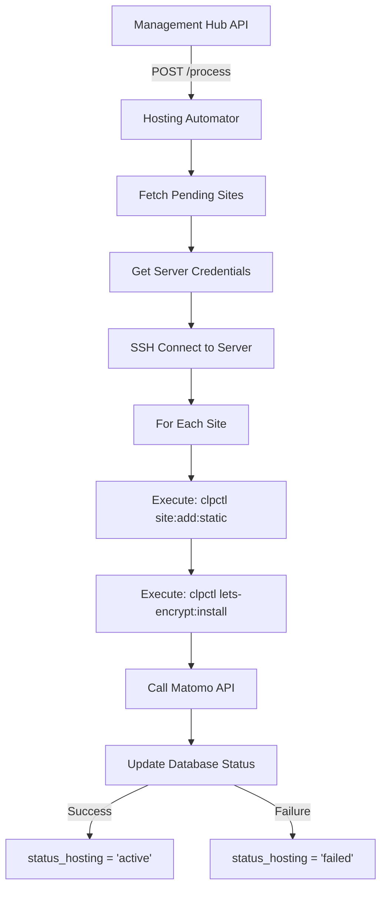

# Hosting Automator - Architecture & Flow Documentation

## Overview

The Hosting Automator is a FastAPI service that automates the provisioning of hosting environments for websites. It handles CloudPanel site creation, SSL certificate provisioning, and Matomo analytics setup through SSH automation.

## Architecture

```
┌─────────────────────────────────────────────────────────┐
│                   Hosting Automator                      │
├─────────────────────────────────────────────────────────┤
│  app.py (FastAPI)                                       │
│    ↓                                                    │
│  hosting_automator/                                     │
│    ├── main.py (Orchestrator)                          │
│    ├── core/                                           │
│    │   ├── config.py (Environment management)          │
│    │   └── logging.py (Structured logging)             │
│    └── services/                                       │
│        ├── supabase_client.py (Database operations)    │
│        ├── cloudpanel_client.py (SSH/CLI automation)   │
│        └── matomo_client.py (Analytics API)            │
└─────────────────────────────────────────────────────────┘
```

## Module Structure

### Entry Point: `app.py`
- FastAPI application that receives requests from Management Hub
- Endpoints:
  - `POST /process` - Main endpoint to trigger hosting automation
  - `GET /health` - Health check endpoint
  - `GET /` - Basic status endpoint

### Core Module: `hosting_automator/main.py`
The main orchestrator that coordinates the entire workflow:

```python
class HostingAutomator:
    def run(site_id: Optional[str])
        1. Fetch pending sites from database
        2. Get server SSH credentials
        3. Connect to CloudPanel server
        4. For each site:
            - Create CloudPanel site
            - Provision SSL certificate
            - Create Matomo tracking (optional)
            - Update database status
```

### Service Modules

#### 1. `supabase_client.py`
Handles all database operations:
- `fetch_pending_hosting_sites()` - Gets sites with status_dns='active' and status_hosting='pending'
- `update_site_hosting_status()` - Updates site status and metadata
- `get_server_credentials()` - Retrieves SSH connection details
- `get_matomo_credentials()` - Gets Matomo API credentials

#### 2. `cloudpanel_client.py`
Manages SSH connection and CloudPanel CLI automation:
- Uses Paramiko for SSH connection
- Executes `clpctl` commands remotely
- Key methods:
  - `connect()` - Establishes SSH connection
  - `execute_command()` - Runs commands via SSH
  - `create_site()` - Creates static site with user
  - `provision_ssl()` - Installs Let's Encrypt certificate

Security features:
- Input sanitization to prevent command injection
- Secure password generation
- Proper SSH key handling

#### 3. `matomo_client.py`
Integrates with Matomo Analytics API:
- `create_tracking_site()` - Creates new site in Matomo
- `check_site_exists()` - Checks for existing sites
- Graceful failure handling (doesn't block hosting if Matomo is down)

## Data Flow



## CloudPanel CLI Commands Used

1. **Site Creation**:
   ```bash
   clpctl site:add:static \
     --domainName=example.com \
     --siteUser=user_examplecom \
     --siteUserPassword='SecurePassword123!'
   ```

2. **SSL Provisioning**:
   ```bash
   clpctl lets-encrypt:install:certificate \
     --domainName=example.com
   ```

## Database Schema

The module interacts with these Supabase tables:

### sites
- `id` - Site identifier
- `domain` - Website domain
- `status_dns` - Must be 'active' to process
- `status_hosting` - Updates to 'active' or 'failed'
- `hosting_doc_root` - Stores site path (e.g., /home/user/htdocs/domain)
- `matomo_site_id` - Stores Matomo tracking ID
- `error_message` - Stores failure reasons

### servers
- `ip_address` - Server IP for SSH
- `ssh_port` - SSH port (default 22)
- `ssh_user` - SSH username
- `ssh_private_key` - Private key for authentication

## Error Handling

1. **SSH Connection Failures**: Logged and site marked as failed
2. **Site Already Exists**: Treated as success (idempotent)
3. **SSL Already Exists**: Treated as success
4. **Matomo Failures**: Logged as warning, doesn't fail the whole process
5. **Command Injection**: Prevented through input sanitization

## Configuration

The service receives all configuration through the Management Hub API request:
```json
{
  "supabase_url": "https://xxx.supabase.co",
  "supabase_service_key": "xxx",
  "site_id": "optional-specific-site"
}
```

No local environment variables needed - everything is injected at runtime.

## Testing

### Unit Tests
Located in `tests/`:
- Test FastAPI endpoints
- Mock SSH connections
- Mock external API calls

### Manual Testing
1. Add a test site to database with:
   - `status_dns` = 'active'
   - `status_hosting` = 'pending'
2. Call the service:
   ```bash
   curl -X POST http://localhost:8001/process \
     -H "Content-Type: application/json" \
     -d '{
       "supabase_url": "your-url",
       "supabase_service_key": "your-key"
     }'
   ```

## Deployment

### Railway Deployment
1. Push to GitHub
2. Railway auto-deploys from main branch
3. Access via private networking: `http://hosting-automator.railway.internal`

### Local Development
```bash
# Install dependencies
pip install -r requirements.txt

# Run service
uvicorn app:app --reload --port 8001
```

## Security Considerations

1. **SSH Keys**: Never logged, stored securely in database
2. **Command Injection**: All inputs sanitized with regex whitelist
3. **Password Generation**: Uses Python's `secrets` module
4. **API Tokens**: Received per-request, not stored locally
5. **Error Messages**: Sanitized to avoid leaking sensitive info

## Monitoring

- Health endpoint: `/health`
- Structured logging with levels (INFO, WARNING, ERROR)
- Status tracking in database for each operation
- Error messages stored for failed operations

## Integration Points

### Inputs
- Sites with `status_dns='active'` from database
- SSH credentials from `servers` table
- Matomo credentials from database (optional)

### Outputs
- CloudPanel site created with document root
- SSL certificate provisioned
- Matomo tracking site created (optional)
- Database updated with status and metadata

## Common Issues

1. **SSH Connection Refused**
   - Check server firewall
   - Verify SSH key format
   - Ensure correct port

2. **CloudPanel Commands Fail**
   - Verify CloudPanel is installed
   - Check user permissions
   - Ensure domain DNS is pointed correctly

3. **Matomo API Errors**
   - Verify Matomo is running
   - Check API token validity
   - Ensure network connectivity